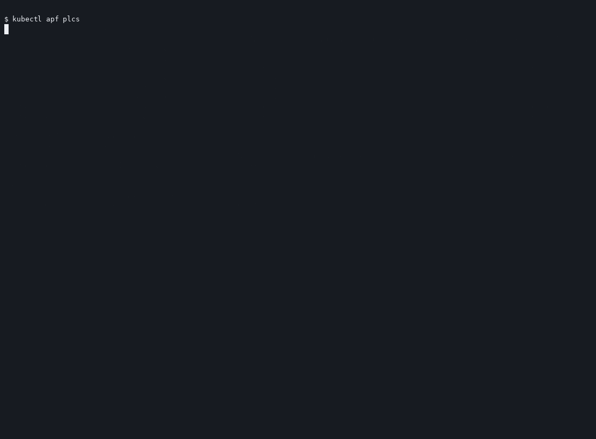

# kubectl-apf

`kubectl apf` shows API Priority and Fairness (APF) priority levels, the flow schemas that select into them, and the API server's in-memory debug dumps for queues and requests.

`plcs` and `detail` list priority levels and join the live counters. `flows` lists FlowSchema objects. `match` reports which schema a user, verb, and resource would hit. `queues`, `requests`, and `users` read the current dump. Requests that start and finish between polls never appear. A record of requests over a long interval is the API server audit log.

`--context` and `--kubeconfig` work the same way as kubectl.

| Command | What it shows |
|---|---|
| `kubectl apf` | Help |
| `kubectl apf plcs` | Priority levels, including waiting, executing, rejected, timed-out, and cancelled counts, plus busy/total queues. `plc` is an alias |
| `kubectl apf detail <name>` | One priority level and the flow schemas under it. `all` shows every level. No argument prints help |
| `kubectl apf flows [name]` | Flow schemas in matching order. A name prints that schema's subjects and rules. `flowschema` and `flowschemas` are aliases |
| `kubectl apf match` | Which flow schema a user, verb, and resource would hit |
| `kubectl apf users [name...]` | Users waiting or holding seats, from the current request snapshot |
| `kubectl apf queues [name...]` | Queues with requests waiting or executing. `queue` is an alias. `--all` includes idle queues. Names limit the list to those priority levels |
| `kubectl apf requests [name...]` | Requests waiting or executing right now. Names limit the list to those priority levels. `--omit-observer` hides this command's own debug request |

## Demo

Recorded on a one-node [kind](https://kind.sigs.k8s.io/) cluster with no CNI and no kube-proxy.



Play the same recording with `asciinema play docs/kubectl-apf.cast`.

## Install

Download the [latest release](https://github.com/marinoborges/kubectl-apf/releases/latest) archive for the machine and put `kubectl-apf` on `PATH`. The binary name has to be `kubectl-apf`. kubectl turns `kubectl apf` into that executable.

```bash
mkdir -p ~/.local/bin
curl -fsSL -o /tmp/kubectl-apf.tar.gz \
  https://github.com/marinoborges/kubectl-apf/releases/latest/download/kubectl-apf_linux_amd64.tar.gz
tar -xzf /tmp/kubectl-apf.tar.gz -C ~/.local/bin kubectl-apf
chmod +x ~/.local/bin/kubectl-apf
```

| Machine | Archive |
|---|---|
| Mac, Apple silicon | `kubectl-apf_darwin_arm64.tar.gz` |
| Mac, Intel | `kubectl-apf_darwin_amd64.tar.gz` |
| Ubuntu, 64-bit Intel or AMD | `kubectl-apf_linux_amd64.tar.gz` |
| Ubuntu, 64-bit ARM | `kubectl-apf_linux_arm64.tar.gz` |

If `~/.local/bin` is not already on `PATH`, add it in `~/.bashrc` on Ubuntu or `~/.zshrc` on a Mac:

```bash
export PATH="$HOME/.local/bin:$PATH"
```

`kubectl apf version` prints the installed release.

## Permissions

Listing the objects needs `get` and `list` on `flowschemas` and `prioritylevelconfigurations` in the `flowcontrol.apiserver.k8s.io` API group.

Live counters come from `/debug/api_priority_and_fairness/dump_priority_levels`, `/debug/api_priority_and_fairness/dump_queues`, and `/debug/api_priority_and_fairness/dump_requests`. A cluster admin can call those. Anyone else needs `get` on that non-resource URL. When the debug call is forbidden, `kubectl apf` still prints the objects and says the counters are unavailable. `kubectl apf requests` needs the debug endpoint.

## Develop

```bash
go test ./...
go build -o kubectl-apf .
go run . version
```

Releases are built with GoReleaser from `.goreleaser.yaml`. Pushing a version tag runs the release workflow, which publishes the archives and opens the [krew](https://krew.sigs.k8s.io/docs/developer-guide/distributing-with-krew/) index update from `.krew/apf.yaml`.
